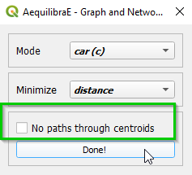
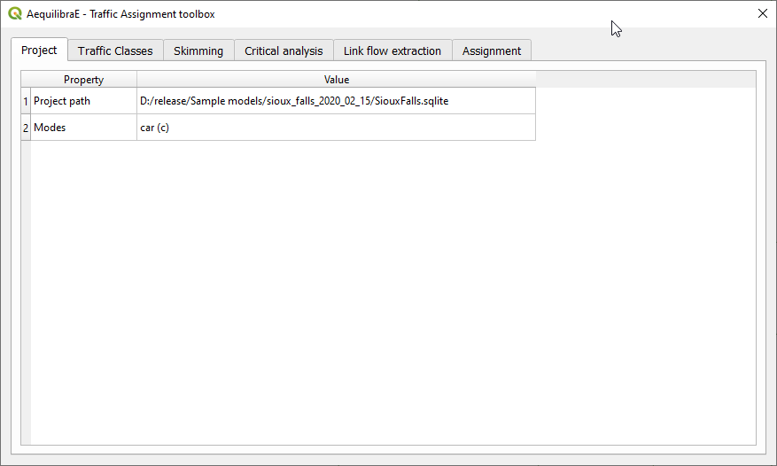
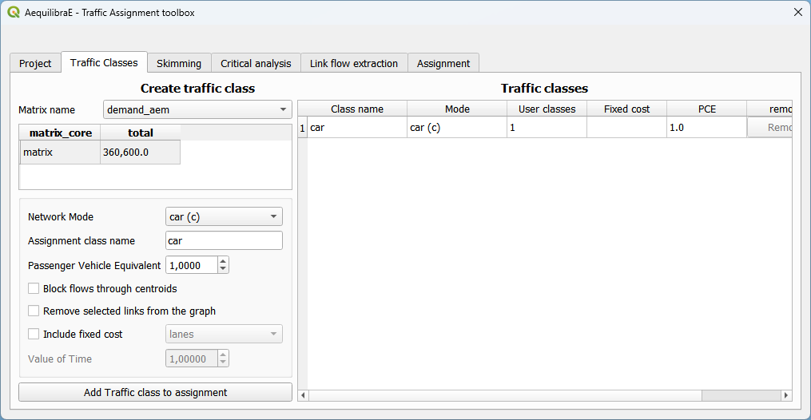
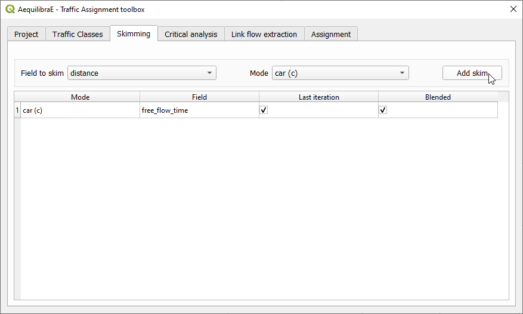
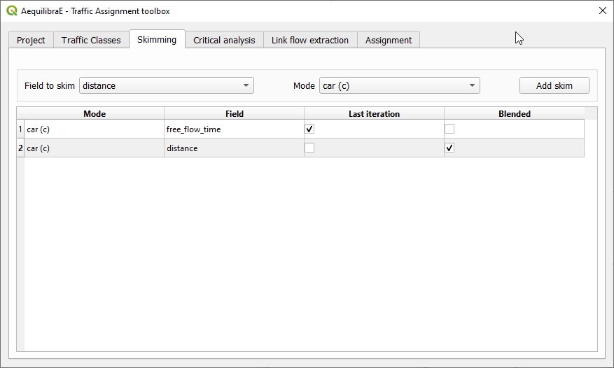
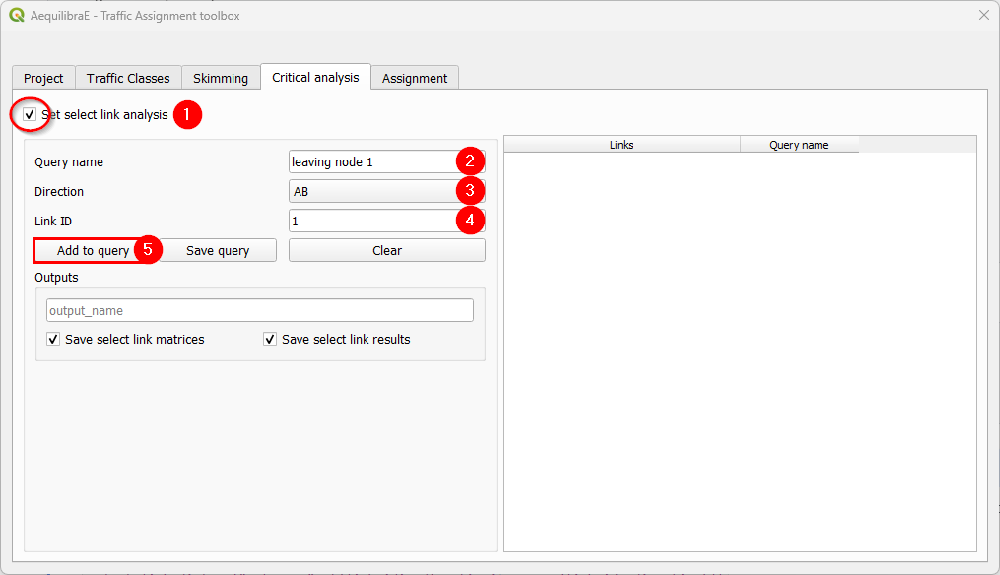
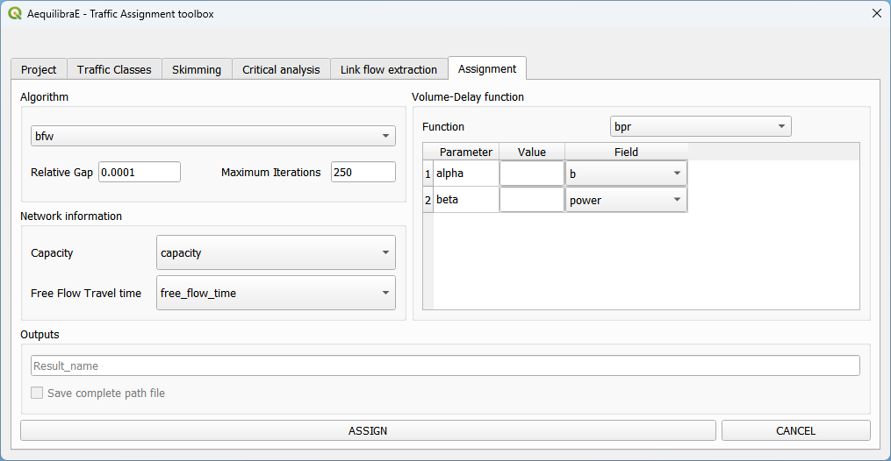

Paths and Assignment
====================

From version 0.6, AequilibraE plugin does not require the user to create the graph to perform
path computation as in previous versions. In this version, as you set up your own configurations,
the software already computes the graph for you.

.. _siouxfalls-individual-path-computation:

Shortest Path
-------------

The first thing we can do with this project is to compute a few arbitrary paths
to see if the network is connected and if paths make sense.

Before computing a path, we go to the configuration screen.

.. image:: ../images/configure_path_computation.png
    :width: 250
    :align: center
    :alt: configure_path_computation

For the case of Sioux Falls, we need to configure the graph to accept paths
going through centroids (all nodes are centroids), but that is generally not the
case. For zones with a single connector per zone it is slightly faster to also
deselect this option, but use this carefully.

If we select that paths need to be in a separate layer, then every time you
compute a path, a new layer with a copy of the links in that path will be
created and formatted in a noticeable way. You can also select to have links
selected in the layer, but only one path can be shown at time if you do so.

.. _siouxfalls-skimming:

Impedance Matrix (aka Skimming Matrix)
--------------------------------------

We can also skim the network to look into general connectivity of the network.

To perform skimming, we can select to compute a matrix from all nodes to all nodes,
or from centroids to centroids, as well as to not allow flows through centroids.

The main controls, however, are the mode to skim, the field we should minimize
when computing shortest paths and the fields we should skim when computing those
paths.

With the results computed (AEM or OMX), one can display them on the screen, loading the 
data using the :ref:`non-project data tab <fig_nonproject_data>` in **Data > Visualize data**. 

.. _siouxfalls-traffic-assignment-and-skimming:

Traffic assignment
------------------

Having verified that the network seems to be in order, one can proceed to
perform traffic assignment, since we have a demand matrix.

The Traffic Assignment procedure tab looks like this!

In the *Traffic Classes* tab you will create the traffic classes used in the project.
First, select one of the available matrices (in \*.AEM or \*.OMX format), and the matrix core
that will be used for computation. For the Sioux Falls example, we don't want to block
flow through centroids, but this is only necessary because regular nodes of the network are centroids. 
When you finish, just press the *Add Traffic class to assignment* button.

To select skims, we need to choose which fields/modes we will skim

And if we want the skim for the last iteration (like we would for time) or if we
want it averaged out for all iterations (properly averaged, that is).

Next, we can choose to run a select link analysis. Its default configuration is not
to select any links, so we have to toggle its *"Set select link analysis"* button.

The creation of queries for analysis consists in: create a name for the query,
select the travel direction, add the link ID, and click on *Add to query*, to temporarily
save the data to the query.

Adding more links to the previous query is straightforward. Select the direction
and the link ID, and press *Add to query* once again.

When we are done with the current query, we click on *Save query*, and notice that
the query with the selected links is going to appear in the right-hand side table.

To finish the select link analysis step, we choose one name to save one or both of
the matrix and results files.

.. image:: ../images/select_link_5.png
    :width: 898
    :align: center
    :alt: Select link analysis 5

The final step is to setup the assignment itself.

Here we select the fields for:

* link capacity
* link free flow travel time
* BPR's *alpha*
* BPR's *beta*

We also confirm the Relative gap and maximum number of iterations we want, the
assignment algorithm and the output folder. In this case, we again choose to not
block flows through centroids for the reason discussed above.

.. _usage-of-results-layer-join:

The result of the traffic assignment we just performed is stored in the results.sqlite
database within the project folder. It can be easily accessed and loaded by clicking
**Data > Visualize data**, and a project data window will open. Just click on the
*Results* tab, select the desired result, let the *Join with layer* option checked,
and click in the *Load Result table as data layer* button at the bottom. The result table
layer will be automatically joined with the links layer.

Now we can revisit the instructions for :ref:`siouxfalls-stacked-bandwidth`

Route choice
------------

With route choice sub-module it is possible to create choice sets through multiple algorithms
and also assign trips to the network using the traditional path-size logit.

In the tab "Route choice model", we'll add the model configurations. It consists of
three different boxes. The first box "*Choice set generation*", in which we input parameters to 
build the choice models. In the "*Route choice model"*, we'll add the parameters for the route 
choice model, such as the cost function and the PSL (beta) value. Finally, in 
"*Graph configuration*" we set up the graph used for computation.

In the tab "Critical analysis", we can select if we want to run one of select link or sub-area 
analysis. These analysis cannot be run at the same time in QAequilibraE. If you run sub-area 
analysis, all OD pairs with demand are considered for computation. To select only a few pairs
of interest, we encourage you to take a look at 
`Route choice with sub-area analysis <https://www.aequilibrae.com/develop/python/route_choice/_auto_examples/plot_subarea_analysis.html>`_ 
at AequilibraE's python documentation and run this task outside QGIS.

Lastly, the tab "Workload" consists in running the workflows. The first box, "*Execute single*"
consists in computing the route choices between two different nodes and visualize it, while the
second box "*Matrix*" allows selecting the demand data used in the model, and which tasks we'll
execute: only build the choice sets or assign the demand for route choice.

We can run different workflows with the route choice sub-model. We'll briefly present them.

Basic route choice
~~~~~~~~~~~~~~~~~~

In this example, we'll generate a route choice for Coquimbo. As this example folder does not
contain any demand matrix, we can manually create an open layer and use its data to import the
matrix to the project, as shown in :ref:`importing_matrices`.

.. _basic_route_choice_setting:

We start setting the route choice parameters. In the "Choice set generation" box, we select the algorithm
to be one of BFLSE or Link Penalization, choose the values for probability cutoff and penalty, and
choose a positive value for one of maximum number of routes or depth.

In the box "Route choice model" box, we configure our cost function. In this example, it is a
function of distance, but could be any other numeric field, such as travel time or tolls.
We then add the parameters to the cost function and it will appear in the cost function box. We can
change the cost function by cleaning it and adding it one more time. To add more parameters to the
cost function, just change the values and click in "Add to cost function" one more time.

Regarding "Graph configuration", we'll use the network for cars and allow flows through centroids.

We can now move directly to the "Workload" tab.

A new window will appear and if we are done with the route choice set generation, we can close it.
But for the sake of this example, we add another OD pair and set the desired number of routes. 

After a few seconds, the output visualization for the routes is shown in the map canvas and we
can close the Execute Single window. The figure below presents the route choice sets, in which
the line width corresponds to the probability of choosing each link.

Build choice sets
~~~~~~~~~~~~~~~~~

Perform assignment
~~~~~~~~~~~~~~~~~~

Sub-area analysis
~~~~~~~~~~~~~~~~~

To run sub-area analysis, we have to set up the parameters for route choice, as presented
:ref:`here <basic_route_choice_setting>`. Then we go straight to the "Critical analysis" tab
and toggle the "Set sub-area analysis" checkbox, which enables us to choose a zone to proceed
with the analysis. In this example, we select a couple zones in Coquimbo, and toggle the
checkbox "Selected features only". We could also use an external polygon layer with the desired
area, so that we use all the layer features rather than a part of it.

Finally, we can run the assignment using all cores of our demand matrix for computation. In
a couple seconds, the route choice window is automatically closed, indicating the end of the
procedure.

Select link analysis
~~~~~~~~~~~~~~~~~~~~~

The left portion of the "Critical analysis" tab corresponds to the select link analysis.
To run it, we have to 

.. Video tutorial
.. ~~~~~~~~~~~~~~

.. .. raw:: html

..     <iframe width="560" height="315" src="https://www.youtube.com/embed/DRY4QpdX3qQ"
..      frameborder="0" allow="accelerometer; autoplay; encrypted-media; gyroscope;
..      picture-in-picture" allowfullscreen></iframe>
