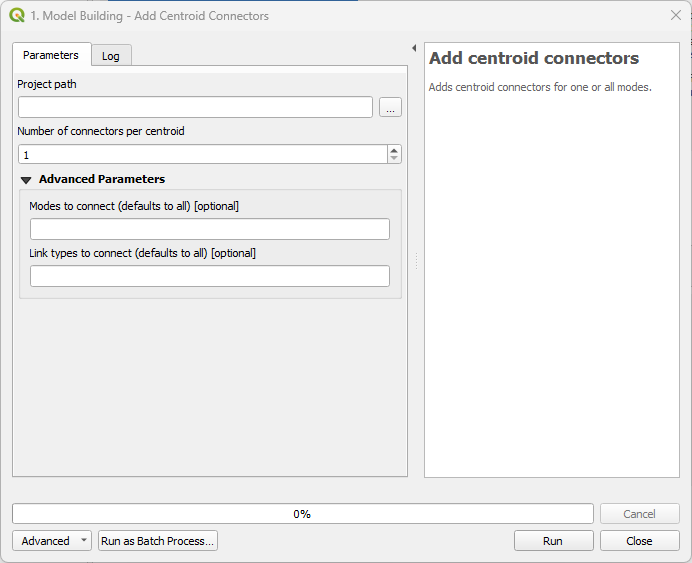
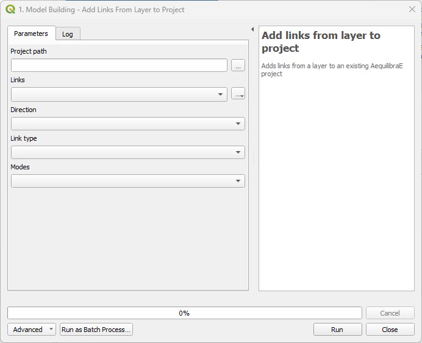
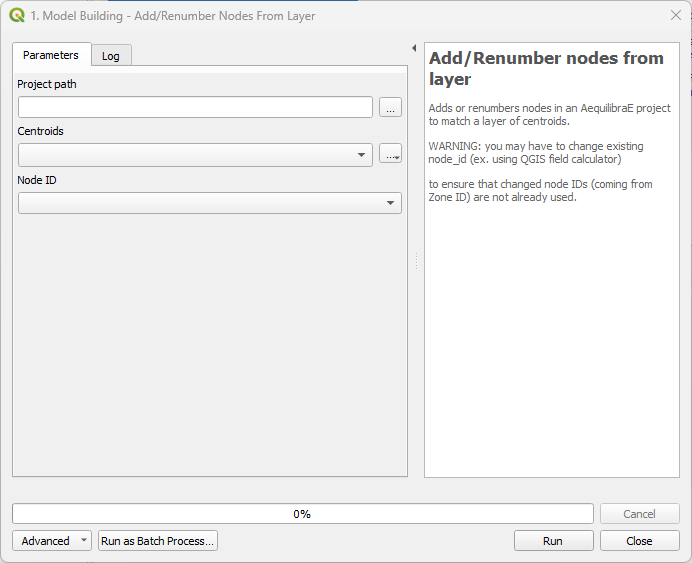
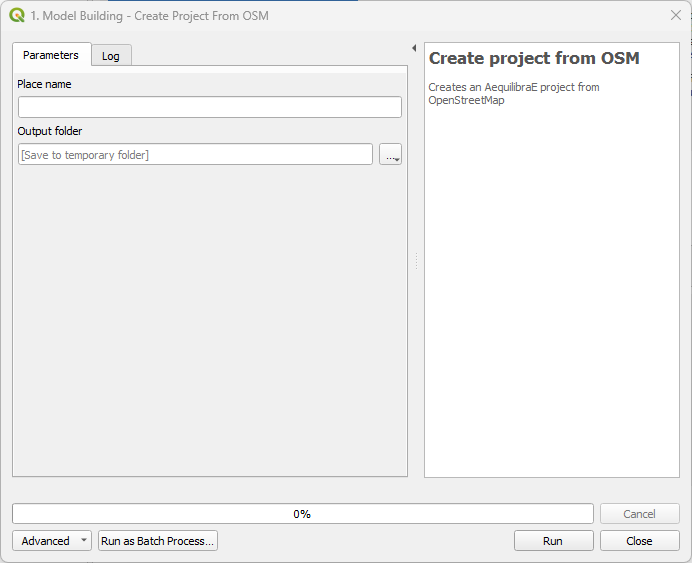
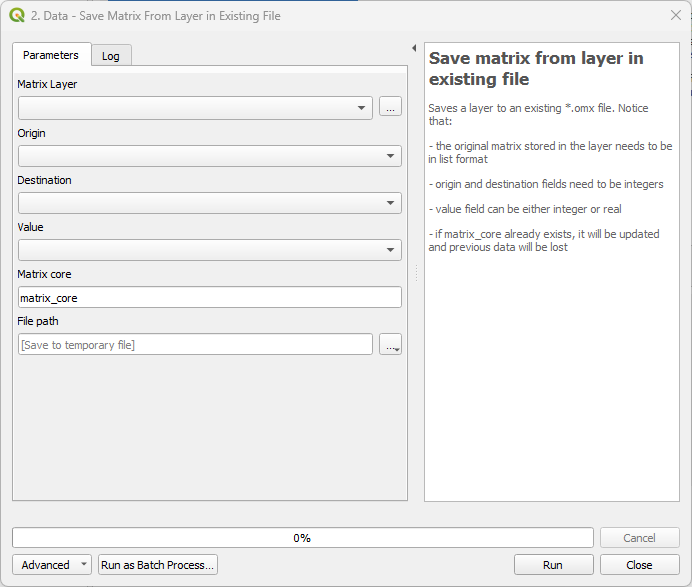
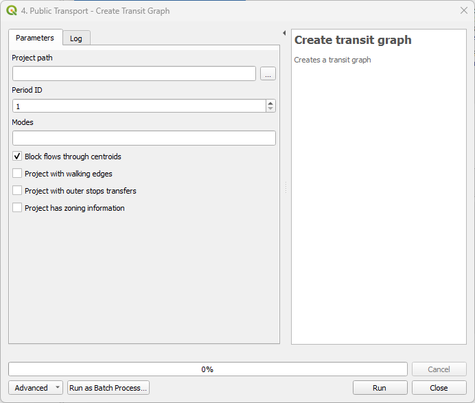
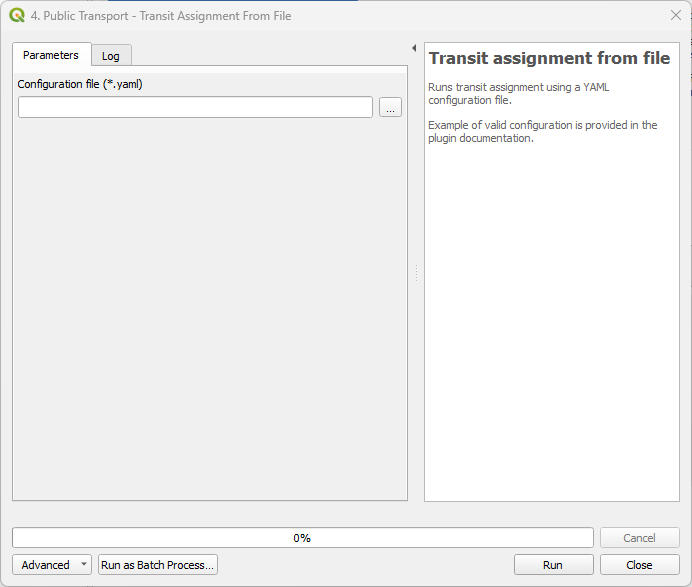

Processing Tools
================

Some of AequilibraE's plugin functionalities are now available in a processing plugin.
The processing plugin is automatically installed with QAequilibraE and allows you to perform
several tasks, such as creating project from links, exporting matrices, and much more,
as a batch process or not. To use the processing plugin, you don't have to directly open
the AequilibraE project, nor have the widget open, although it is mandatory to have 
AequilibraE installed.

To find AequilibraE's processing plugin, click on the **Processing** panel and select **Toolbox**.
You can also use the available QGIS shortcut to open the Toolbox window.

.. image:: images/processing_provider_init.png
    :align: center
    :alt: Processing provider menu

At the bottom of the window, you'll find the AequilibraE logo and the available functions.
The functions are divided into groups, following the same logic as the AequilibraE widget
menu. Notice that not all AequilibraE functionalities are available for processing.

.. subfigure:: AB
    :align: center

    .. image:: images/processing_provider_toolbox-1.png
        :alt: Toolbox General

    .. image:: images/processing_provider_toolbox-2.png
        :alt: Toolbox Detailed

In the following subsections, we'll go over all functionalities.

Model Building
--------------
Add centroid connectors
~~~~~~~~~~~~~~~~~~~~~~~
AequilibraE's processing tool can add centroid connectors to a project's network. All you
need to do is specify the number of centroids and the project folder. You can also choose
the modes and the link types you want to connect, otherwise the default configuration uses
all modes and link types.

Add links from layer to project
~~~~~~~~~~~~~~~~~~~~~~~~~~~~~~~
This tool allows you to add links from a vector layer to your existing project network.
The fields usage is straightforward: in *Project path*, you add the project's path in your
machine, then select a vector layer that corresponds to the new links you want to add to
your project, and indicate the layer fields that correspond to the link type, direction, and
modes. Notice that this tool doesn't require a node layer, nor does it require fields such
as ``a_node`` or ``b_node``, as it will use the existing numbering in the project.

Add/Renumber nodes from layer
~~~~~~~~~~~~~~~~~~~~~~~~~~~~~
You can also add or renumber nodes in an AequilibraE project to match a layer of centroids.
Just select or import the centroids layer, specify the node ID you want to match, and the output
folder.

Create project from link layer
~~~~~~~~~~~~~~~~~~~~~~~~~~~~~~
*Create project from link layer* is similar to the widget menu 
:ref:`Create project from layers <project_from_layers>`, and allows you to create an AequilibraE 
project directly from a link layer, without requiring a node layer. With a geometric layer loaded 
into QGIS, select it in the *Links* button, and add the required data in the subsequent menus. 
Choose the project's name and specify the location where you want to save it on your machine.

Create project from OSM
~~~~~~~~~~~~~~~~~~~~~~~
This tool is similar to the homonymous widget menu 
:ref:`Create project from OSM <create-proj-from-osm>`, and allows you to create an AequilibraE
project only specifying the place name and the folder path and name you want to save the project.

Data
----
Create AequilibraE Matrix from layer
~~~~~~~~~~~~~~~~~~~~~~~~~~~~~~~~~~~~
With *Import matrices*, you can save an open data layer directly as a \*.aem file.
This tool is analogous to the widget menu :ref:`importing_matrices`, but it does not
require an open AequilibraE project to work. To use the tool, you must have an open layer
loaded in QGIS, and the menus are the ones presented in the figure below.

The upper fields are mandatory and are res.. note::ponsible for selecting the layer, indicating
which columns correspond to the origin, destination, and flow, creating a core name for your
matrix, and specifying the output file name and path. In the *Advanced Parameters*, you can add
extra information about your AequilibraE matrix using the fields ``Matrix name`` and 
``Matrix description``.

Export matrices
~~~~~~~~~~~~~~~
The *Export matrices* tool is analogous to the *Export* button in the matrix viewer 
(see: :ref:`this figure <fig_data_visualize_matrices>` for more details). 
Its usage is straightforward: select the matrix you want to export, specify the path
on your machine to store the file, and select its output format. Only \*.aem and \*.omx files can 
be used as input, and the output format can be either one of \*.aem, \*.omx, or \*.csv.

Matrix calculator
~~~~~~~~~~~~~~~~~
Under the hood, this tool performs several matrix calculations using NumPy. Its output is 
an AequilibraE matrix stored in the file path you provide. Notice that not all matrices
operations available in NumPy are also available here. We currently handle the following
operations.

* ``+``, ``-``, ``*``, ``/``
* ``min``, ``max``, ``abs``
* ``ln``, ``exp``, ``power``
* ``null_diag``, ``T``

To be more effective in your calculation, please use the brackets to separate the operations
in the desired order of execution.

The following code blocks present, respectively, examples of a matrix input configuration for 
the YAML file and an expression that can be used for calculation. 

.. code-block:: yaml
    :caption: Matrix configuration

    # For each matrix used for calculation
    - matrix_name1:
        matrix_path: path to file
        matrix_core: specifiy the core name

.. code-block:: yaml
    :caption: Expression

    (matrix_name1 - matrix_name2).T

Save matrix from layer in existing file
~~~~~~~~~~~~~~~~~~~~~~~~~~~~~~~~~~~~~~~
This tools allows you to export the data from an open layer to an existing \*.omx file.

.. important::

    Currently, we cannot add new cores to an existing AequilibraE matrix. For this reason
    the only output file format available is \*.omx. 

Paths and assignment
--------------------
Traffic assignment from file
~~~~~~~~~~~~~~~~~~~~~~~~~~~~
AequilibraE traffic assignment can now be performed using a YAML file that contains the model input
information. The process is straightforward: create a valid YAML file with your project path,
required matrices, and valid parameters, and load it into AequilibraE. 

The code block below contains an example of a valid YAML configuration.

.. code-block:: yaml
    :caption: Traffic assignment configuration

    project: path_to_project
    result_name: test_from_yaml
    traffic_classes:
        - car:
            matrix_path: path_to_project/matrices/demand.aem
            matrix_core: matrix
            network_mode: c
            pce: 1
            blocked_centroid_flows: True
            skims: free_flow_time, distance
    assignment:
        algorithm: bfw
        vdf: BPR2
        alpha: 0.15
        beta: 4.0
        capacity_field: capacity
        time_field: free_flow_time
        max_iter: 10
        rgap: 0.001
    select_links: # optional, name with a list of lists as [[link_id, link_direction]]
        - from_node_1: [[1, 1], [2, 1]]
        - random_nodes: [[3, 1], [5, 1]]

Public Transport
----------------
Create transit graph
~~~~~~~~~~~~~~~~~~~~
Benefiting from new AequilibraE features, this processing tool allows you to create and
save a transit graph to use in the transit assignment. Figure below presents an screenshot
of the create transit graph processing interface.

Notice that you will have to input data such as the project path, the desired mode, and the
period ID for which you want to create your graph. Other graph configuration, such
as ``Block flows through centroids`` and ``Project with walking edges`` are boolean, 
and can be selected as necessary. You can read more about these configuration 
`here <https://www.aequilibrae.com/python/develop/modeling_with_aequilibrae/transit_assignment/transit_graph.html#transit-graph-specificities-in-aequilibrae>`_.

.. note::
    
    Currently only a single transit graph can be saved and reloaded.

Create GTFS
~~~~~~~~~~~
This tool allows you to import a GTFS feed to your project. Just point to the
GTFS zip and project paths in your machine, select the date for which you want to
import the transit routes, and if you want to map-match the routes or not. Remember
that depending on the GTFS size, the map-matching procedure can be really time-consuming.
Unlike the GTFS importer in the widget menu, to use this processing tool you must
know which calendar date you are going to use. 

.. tip::
    
    Mobility Data is a non-profit organization that provides a 
    `GTFS validator tool <https://gtfs-validator.mobilitydata.org/>`_. 
    If you want to use QAequilibraE processing processing provider tool to import a GTFS 
    feed, you can load your GTFS file at their validator and it will provide you useful 
    information, including calendar date ranges.

Transit assignment from file
~~~~~~~~~~~~~~~~~~~~~~~~~~~~
Transit assignment from file is quite similar to the traffic assignment presented above,
with the remarkable differences related to the transit graph and assignment, as shown in
AequilibraE. The YAML file setup includes the project location in your machine, as well as
information on matrix and assignment. To use this tool, you must have a transit graph, 
either created by the processing tool above or using AequilibraE code.

The code block below contains an example of a valid YAML configuration.

.. code-block:: yaml
    :caption: Transit assignment configuration

    project_path: path_to_project
    result_name: transit_from_yaml
    matrix_path: path_to_project/matrices/demand.aem
    matrix_core: workers  
    assignment:
        time_field: trav_time
        frequency: freq
        algorithm: os
    graph:
        period_id: 1
        with_outer_stop_transfers: False 
        with_walking_edges: False
        blocking_centroid_flows: False
        connector_method: overlapping_regions
